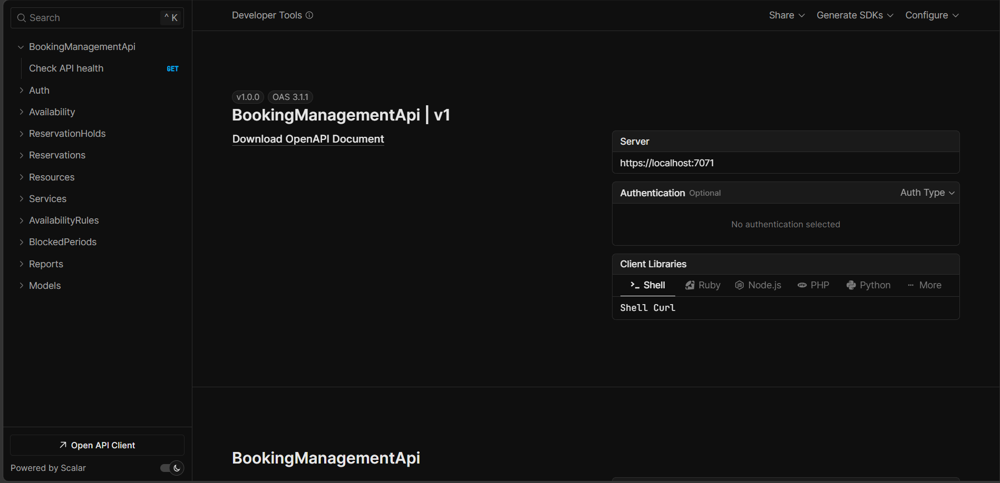
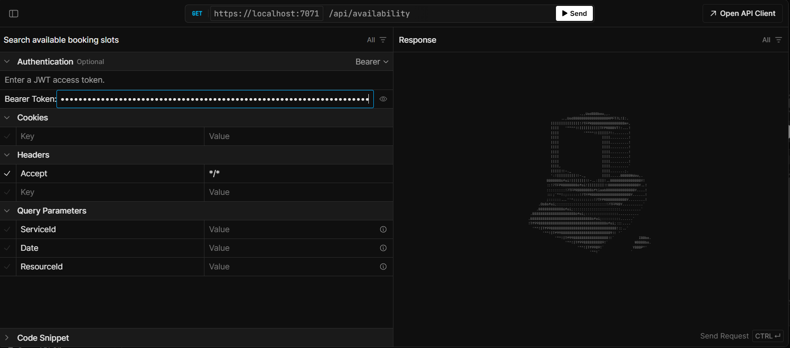
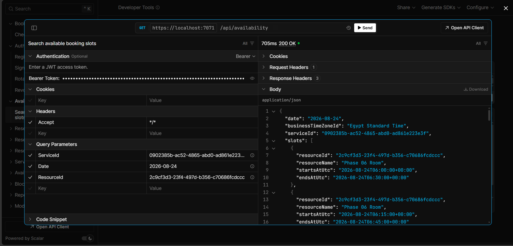
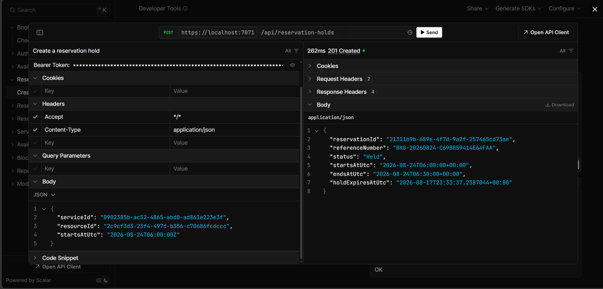
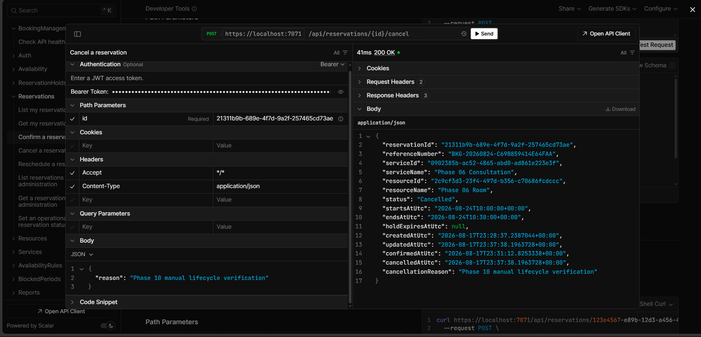
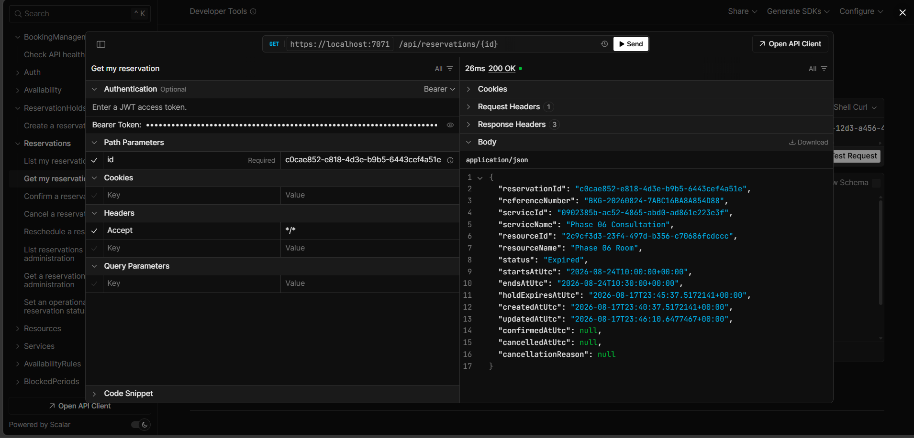
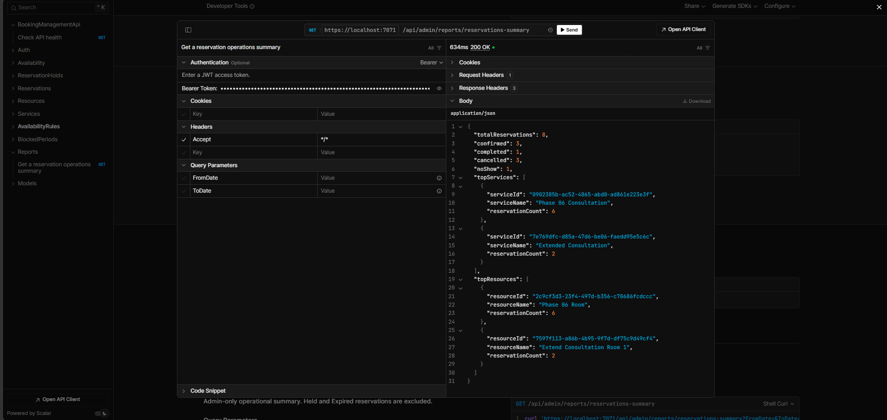

# Booking Management API

A production-style ASP.NET Core booking API focused on scheduling, reservation lifecycle, and SQL Server concurrency correctness. It demonstrates backend work beyond CRUD without hiding important rules behind unnecessary architecture.

## Why This Project Exists

Appointment systems must calculate time-zone-aware availability, protect a slot while a customer decides, enforce lifecycle rules, and remain correct when requests arrive together. This generic API supports clinics, salons, consultants, rooms, equipment, and similar businesses.

## Key Features

- JWT authentication, hashed passwords, Customer/Admin authorization, and refresh-token rotation, revocation, and replay rejection
- Service/resource catalog, assignments, weekly multi-shift availability, blocked periods, time-zone conversion, booking notice, and horizon rules
- Server-derived reservation holds, SQL Server transactional double-booking prevention, and conflict-safe rescheduling
- Confirmation, cancellation cutoff, ownership-safe reads, Admin Completed/NoShow transitions, and automatic hold expiration
- EF Core operational persistence, parameterized Dapper reporting, FluentValidation, Problem Details, Scalar, built-in OpenAPI, and automated real-SQL concurrency tests

## Technology Stack

.NET 10, ASP.NET Core 10, C#, EF Core 10, SQL Server, Dapper, FluentValidation, JWT Bearer, built-in OpenAPI, Scalar, xUnit, and ASP.NET Core integration testing.

## Architecture

The repository has one Web API project and one test project. Thin controllers call focused application services. EF Core handles operational data; Dapper is confined to reporting. `TimeProvider` makes time rules testable, and a framework `BackgroundService` maintains expired hold state. There is no generic repository, CQRS layer, or message broker.

See the consolidated [architecture and booking workflow diagrams](docs/ARCHITECTURE.md).

## Booking Correctness and Concurrency

Availability search is advisory; hold creation is authoritative. Inside a short transaction, SQL Server takes an `UPDLOCK, HOLDLOCK` on the selected resource before the final overlap query. For the same resource/time, one concurrent request creates a hold and the other receives `409 Conflict`; different resource rows can proceed independently. This single-database V1 needs no distributed lock.

## Reservation Lifecycle

```text
Held -> Confirmed -> Cancelled | Completed | NoShow
  |        |
  +-> Cancelled
  +-> Expired
```

Cancelled, Completed, NoShow, and Expired are terminal. Confirmation safely returns an already-confirmed reservation, expired holds cannot be confirmed, and confirmed cancellation observes the configured cutoff. V1 rescheduling keeps the same service/resource, recalculates end time, and leaves the original unchanged after a conflict.

## Background Hold Expiration

A `BackgroundService` uses `PeriodicTimer`, `TimeProvider`, a scoped processor, batches of 100, and an idempotent conditional update. Cleanup timing does not determine correctness: logically expired holds are non-blocking before Expired is persisted.

## Reporting

`GET /api/admin/reports/reservations-summary` is an Admin-only Dapper report with inclusive optional `fromDate`/`toDate`. It includes Confirmed, Completed, Cancelled, and NoShow; excludes Held and Expired; and returns counts plus the top five services/resources.

## API Areas

| Area | Endpoints |
|---|---|
| Authentication | `POST /api/auth/register`, `/login`, `/refresh-token`, `/logout` |
| Catalog | `GET /api/services`, `GET /api/resources` and item routes |
| Availability | `GET /api/availability` |
| Reservations | `POST /api/reservation-holds`; list, details, confirm, cancel, reschedule under `/api/reservations` |
| Admin | Services, resources, assignments, schedules, blocked periods, and reservations under `/api/admin` |
| Reporting | `GET /api/admin/reports/reservations-summary` |
| Operations | `GET /health` |

## Getting Started

Prerequisites: .NET 10 SDK and SQL Server LocalDB or SQL Server. EF Core CLI is a repository-local tool.

```powershell
git clone <repository-url>
cd BookingManagementApi
dotnet tool restore
dotnet restore
dotnet user-secrets set "Jwt:Key" "<a strong local development key of at least 32 bytes>" --project src/BookingManagementApi/BookingManagementApi.csproj
dotnet ef database update --project src/BookingManagementApi/BookingManagementApi.csproj --startup-project src/BookingManagementApi/BookingManagementApi.csproj
dotnet run --project src/BookingManagementApi/BookingManagementApi.csproj --launch-profile https
```

The default is LocalDB database `BookingManagementApi`. Override it without committing credentials:

```powershell
dotnet user-secrets set "ConnectionStrings:DefaultConnection" "<local SQL Server connection string>" --project src/BookingManagementApi/BookingManagementApi.csproj
```

URLs: API `https://localhost:7071`; Scalar `/scalar/v1`; OpenAPI `/openapi/v1.json`; health `/health`.

## Admin Demo Account Setup

Public registration always creates Customer. For a local demo only, register a user and promote exactly that user through SQL Server administration:

```sql
DECLARE @Email nvarchar(320) = N'admin.demo@example.test';
UPDATE dbo.Users SET Role = N'Admin' WHERE NormalizedEmail = UPPER(@Email);
```

This is not an Admin-registration endpoint. Production should use controlled identity/admin provisioning.

## Demo Walkthrough

1. Register, log in, authorize Scalar with the Bearer access token, rotate the refresh token, then log out. Never save real credentials/tokens.
2. As Admin, create a service/resource, assign them, add weekly availability, then query `/api/availability?serviceId=<guid>&date=2026-08-20`; slots are advisory.
3. As Customer, create a hold with representative IDs and a returned UTC start, then confirm, list/details, reschedule, and cancel.
4. Leave a hold past `holdExpiresAtUtc`; the worker later persists Expired.
5. As Admin, request the reservation summary with optional date filters.

## Testing

```powershell
dotnet restore
dotnet build --no-restore
dotnet test --no-restore
git diff --check
```

Real locking, reschedule concurrency, expiration SQL, and Dapper correctness require SQL Server. Tests create isolated temporary databases and remove them afterward:

```powershell
$env:BOOKING_TEST_SQLSERVER_CONNECTION = "Server=.;Database=master;Integrated Security=True;Encrypt=False;MultipleActiveResultSets=True"
dotnet test --no-restore
```

EF Core InMemory is used only where relational correctness is not under test. Coverage areas include auth/refresh, authorization, catalog, scheduling, availability, lifecycle, SQL concurrency, background expiration, Dapper reporting, validation, Problem Details, and OpenAPI.

## Portfolio Screenshots

These are genuine manual captures from the running API. See the [capture checklist](screenshots/README.md) for the verified content and safety requirements.









## Design Decisions and V1 Boundaries

V1 intentionally has no frontend, payments, multi-tenancy, distributed locks, Redis, message broker, Hangfire/Quartz, arbitrary Admin reservation edits, or cross-resource/service rescheduling. These boundaries focus review on scheduling, transactions, security, and API quality.

## What This Demonstrates

For a technical reviewer or freelance client: ASP.NET Core API design, JWT security, SQL Server transactions/concurrency, scheduling rules, background processing, Dapper integration, safe errors, and integration testing.
