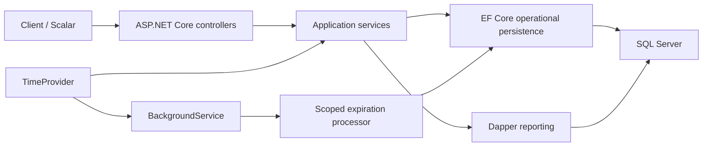
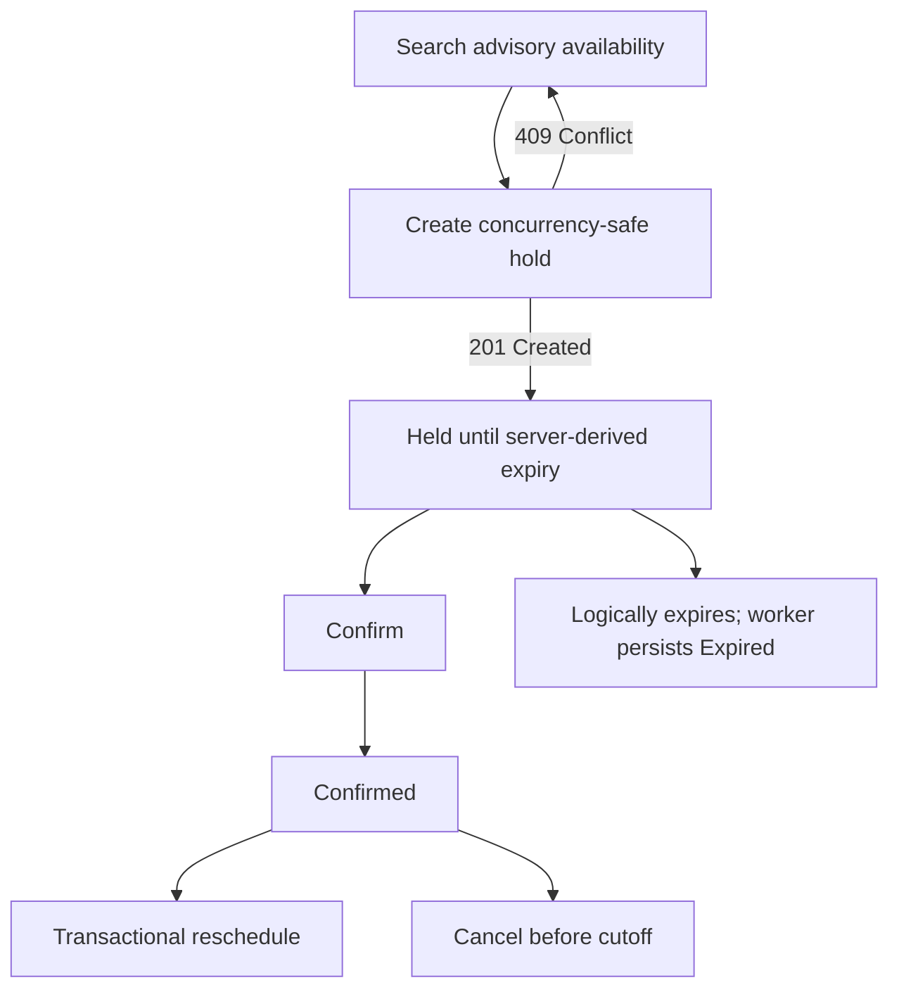
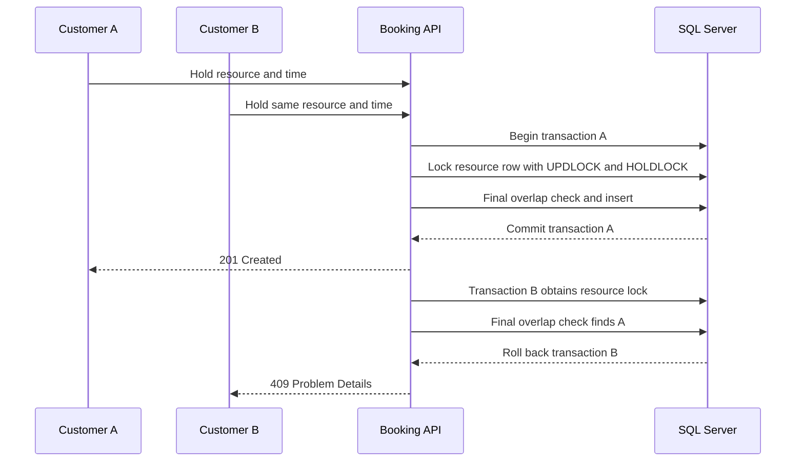

# Architecture and Booking Workflows

## System Architecture

```mermaid
flowchart LR
    Client["Client / Scalar"] --> API["ASP.NET Core controllers"]
    API --> Services["Application services"]
    Services --> EF["EF Core operational persistence"]
    Services --> Dapper["Dapper reporting"]
    EF --> SQL["SQL Server"]
    Dapper --> SQL
    Worker["BackgroundService"] --> Processor["Scoped expiration processor"]
    Processor --> EF
    Clock["TimeProvider"] --> Services
    Clock --> Worker
```

## Booking and Reservation Workflow

```mermaid
flowchart TD
    Search["Search advisory availability"] --> Hold["Create concurrency-safe hold"]
    Hold -->|"201 Created"| Held["Held until server-derived expiry"]
    Hold -->|"409 Conflict"| Search
    Held --> Confirm["Confirm"]
    Held --> Expire["Logically expires; worker persists Expired"]
    Confirm --> Confirmed["Confirmed"]
    Confirmed --> Reschedule["Transactional reschedule"]
    Confirmed --> Cancel["Cancel before cutoff"]
```

## SQL Concurrency and Double-Booking Prevention

```mermaid
sequenceDiagram
    participant A as Customer A
    participant B as Customer B
    participant API as Booking API
    participant SQL as SQL Server
    A->>API: Hold resource and time
    B->>API: Hold same resource and time
    API->>SQL: Begin transaction A
    API->>SQL: Lock resource row with UPDLOCK and HOLDLOCK
    API->>SQL: Final overlap check and insert
    SQL-->>API: Commit transaction A
    API-->>A: 201 Created
    API->>SQL: Transaction B obtains resource lock
    API->>SQL: Final overlap check finds A
    SQL-->>API: Roll back transaction B
    API-->>B: 409 Problem Details
```
